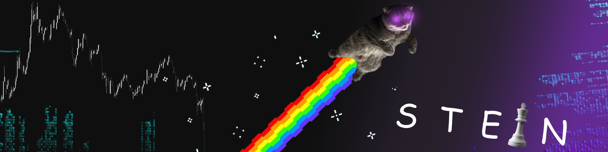

### ABOUT ME -----------------------------------[ X ]

[☝️] ~ Fun [💻] ~ Fullstack [🧪] ~ AI's  [📉] ~ Crypto

## Contact me ---------------------------
  

## What I do -----------------------------
                                                          
## Stats -----------------------------

## Donate  ---------------------------
    
